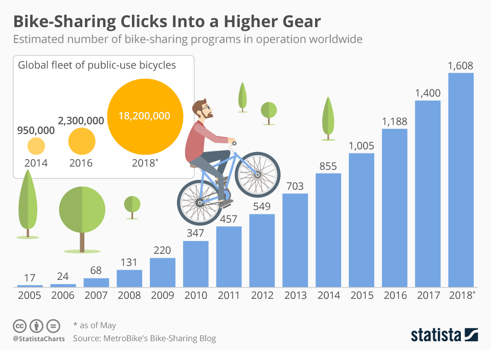

## **Predicting Bike Sharing Demand with Regression Models** 
---
By Aditya Nugraha

*Image Source: https://www.freepik.com/vectors/ride-bicycle*

### **Contents**
---

1. Business Problem Understanding
2. Data Understanding
3. EDA & Feature Engineering
4. Modeling
5. Conclusion
6. Recommendation
7. Save Model

**Context**

Sistem penyewaan sepeda adalah sarana penyewaan sepeda dimana proses mendapatkan keanggotaan, sewa, dan pengembalian sepeda secara mandiri melalui jaringan lokasi seperti kios di seluruh kota. Dengan menggunakan sistem ini, orang dapat menyewa sepeda dari satu lokasi dan mengembalikannya ke lokasi lain sesuai kebutuhan. Menurut data yang di rilis pada situs [Statista.com](https://www.statista.com/chart/14542/bike-sharing-programs-worldwide/) Hingga pertengahan tahun 2018, ada sekitar 1600 program penyewaan sepeda dengan 18,2 juta sepeda di lebih dari 1000 kota.

*Image Source: https://www.statista.com/chart/14542/bike-sharing-programs-worldwide/*

**Problem Statement**

Terlepas dari efek positifnya pada lalu lintas, masalah lingkungan dan kesehatan, sistem penyewaan sepeda sangat menarik karena data yang mereka hasilkan dapat digunakan untuk tujuan penelitian. Waktu keberangkatan dan kedatangan, lokasi dan durasi penggunaan dicatat dalam sistem ini. Data tersebut dapat digunakan untuk memprediksi kapan waktu, kondisi, dan tempat yang tepat bagi masyarakat untuk melakukan penyewaan sepeda, sekaligus menjadi masalah tersendiri bagi penyedia sistem penyewaan sepeda ini untuk **mengetahui seberapa banyak sepeda yang harus di distribusikan agar sepeda mereka dapat digunakan secara efisien sehingga mengurangi kemungkinan adanya kondisi yang mempunyai banyak sepeda namun sedikit yang menggunakannya ataupun sebaliknya.**

**Goals**

Berdasarkan permasalahan yang telah dijelaskan sebelumnya, pihak yang mengadakan program penyewaan sepeda perlu memiliki 'tool' yang dapat digunakan untuk **memprediksi seberapa banyak sepeda yang harus di distribusikan berdasarkan kondisi tertentu**. adanya perbedaan kondisi dan waktu dapat menambah keakuratan dalam memprediksi banyaknya sepeda yang digunakan, yang mana dapat mendistribusikan sepeda secara efisien sehingga penyedia dapat memaksimalkan keuntungan dari penyewaan tersebut.

**Analytics Approach**

Jadi, yang perlu dilakukan adalah menganalisis data untuk menemukan pola dari fitur-fitur yang ada, yang membedakan pada kondisi dan waktu tertentu.

Selanjutnya, kita akan membangun suatu model untuk memprediksi suatu nilai numerik atau biasa disebut dengan model regresi, model ini dapat digunakan sebagai 'tool' yang membantu penyedia sistem penyewaan sepeda ini untuk memprediksi banyaknya penyewa berdasarkan kondisi dan waktu tertentu.

**Metrics Evaluation**

Evaluasi metrik yang kita gunakan yang paling difokuskan adalah RMSE dan RMSLE, namun kita juga akan menggunakan MAE dan MAPE sebagai pembanding pada kasus ini.
* RMSE merupakan nilai rataan akar kuadrat dari error, metrik ini dapat digunakan untuk mengukur seberapa jauh nilai prediksi yang dihasilkan berdasarkan rataannya.
* RMSLE adalah nilai rataan akar kuadrat dari error yang digunakan khusus jika fitur target ditransformasikan menggunakan perhitungan logaritma, kita dapat mengunakan metrik ini untuk menghitung rasio antara nilai aktual dan prediksinya. nilai dari metrik ini dapat mereduksi error yang ditimbulkan oleh outliers atau perbedaan nilai yang terlalu jauh.
* MAE adalah rataan nilai absolut dari error
* MAPE adalah rataan persentase error yang dihasilkan oleh model regresi, dengan nilai keakuratan berdasarkan buku dari [Lewis's (1982)](https://www.nrpa.org/globalassets/journals/jlr/2003/volume-35/jlr-volume-35-number-4-pp-441-454.pdf) mengatakan bahwa jika nilai MAPE sebesar 0.10 atau 10% merupakan prediksi yang sangat akurat, 11-20% merupakan prediksi yang baik, 21-50% merupakan prediksi yang masuk akal, dan 51% dan lebih banyak lagi adalah prediksi yang tidak akurat, adapun jika lebih dari 100% merupakan prediksi yang sangat tidak akurat.

Semakin kecil nilai RMSLE, MAE, dan MAPE yang dihasilkan, berarti model semakin akurat dalam memprediksi banyaknya penyewa sepeda dengan limitasi fitur yang digunakan. 

### **Data Understanding**
---

Sistem penyewaan sepeda sangat berkorelasi dengan kondisi lingkungan dan musim. Misalnya, kondisi cuaca,
curah hujan, hari dalam seminggu, musim, jam dalam sehari, dll. hal tersebut dapat mempengaruhi perilaku penyewa apakah seseorang dengan kondisi tersebut ingin menyewa sepeda atau tidak.

* Dataset menunjukkan data sewa sepeda per jam selama dua tahun (2011 dan 2012). 
* Memiliki 11 atribut yang masing-masing menunjukan waktu penyewaan, kondisi lingkungan, dan banyaknya sepeda yang disewa

|Atribute|Data Type|Description|
|---|---|---|
|dteday|Datetime|Date|
|hum|Float|Normalized Humadity. The values are divided to 100 (maximum value)|
|weathersit|Integer|1: Clear, few clouds, partly cloudy 2: Mist, cloudy, mist and broken clouds, mist and few clouds 3: Light snow, light rain and thunderstorm and scattered clouds, light rain and scattered clouds 4: Heavy rain, ice pallets, thunderstorm and mist, snow and fog|
|holiday|Integer|Whether the day is holiday or not (1: holiday, 0: not holiday). References: [2011](https://dchr.dc.gov/page/holiday-schedules-2010-and-2011), [2012](https://dchr.dc.gov/page/holiday-schedules-2012-and-2013)|
|season|Integer|Season (1: Winter, 2: Spring, 3: Summer, 4: Fall)|
|atemp|Float|Normalized feeling temperature in Celsius. The values are divided to 50 (maximum value)|
|temp|Float|Normalized temperature in Celsius. The values are divided to 41 (maximum value)|
|hr|Integer|Hour (0 to 23)|
|casual|Integer|Count of casual users|
|registered|Integer|Count of registered users|
|cnt|Integer|Count of hourly total rental bikes including both casual and registered (Target variable)|

### **EDA & Feature Engineering**
---

- Beradasarkan penelitian yang dilakukan, dataset yang digunakan tidak memiliki NaN maupun data terduplikat.
- Kami juga menghapus kolom `casual` dan `registered` karena 2 kolom tersebut telah terwakilkan oleh kolom target yaitu `cnt`
- Untuk menangani outlier sendiri untuk tahap awal kami menggunakan pendekatan [Chebyshev’s & Empirical rules](https://www.csus.edu/indiv/s/seria/lecturenotes/chebyshev.htm) menggunakan standar deviasi 3 dari mean, dengan begitu kita akan menyaring dan menggunakan 99.7% data yang tidak menyimpang atau menghilangkan 0.3% data yang menyimpang.
- sekaligus kami juga menggunakan Log Transformation pada kolom target yaitu `cnt` dengan asumsi data yang dihasilkan bukan merupakan suatu kesalahan yang berarti nilai pada kolom tersebut akan kami anggap sebagai outlier alami, sehingga tidak dapat dihapus lebih jauh lagi. pada tahap ini tingkat kemiringan pada kolom target yaitu `cnt` dari yang sebelumnya 1.045 menjadi -0.824 yang berarti lebih dekat dengan kemiringan simetris yaitu 0.5 atau -0.5
- Untuk EDA standar lainnya kami juga mengecek menggunakan plot kategori dan plot distribusi pada masing-masing tabel yang berjenis kategori dan berjenis numerik.

### **Modeling**
---

**Date Extraction**

Untuk memperkaya data dan mempermudah dalam melakukan interpretasi maka fitur `dteday` akan kita ekstrak menjadi bagiannya sendiri, fitur baru hasil ekstraksi beserta keterangannya bisa dilihat tabel dibawah.

|Atribute|Data Type|Description|
|---|---|---|
|year|Integer|Year (2011 to 2012)|
|month|Integer|Month (1 to 12)|
|day|Integer|Day (1 to 31)|
|weekday|Integer|Day of the week (0: Sunday, 1: Monday, 2: Tuesday, 3: Wednesday, 4: Thursday, 5: Friday, 6: Saturday)|
|workingday|Integer|If the day is neither weekend (saturday & sunday on weekday column) nor holiday is 1, otherwise is 0|

**Data Spliting**
Pada tahap ini kita melakukan pembagian data, disini kita tentukan fitur target yaitu adalah `cnt` dan sisanya akan masuk pada pemodelan untuk menemukan pola, selanjutnya akan ada pemisahan antara data untuk di latih dan data untuk melakukan tes/validasi

**Encoding** 

kita perlu melakukan encoding pada fitur kategorik karena komputer tidak dapat memproses data berbentuk kategorik, walaupun nilainya sudah berupa angka namun itu adalah nilai kategorik, jika di proses dengan data seperti itu maka akan membuat model salah dalam melakukan prediksi.

**One-Hot:** season, year, weekday, weathersit, holiday  
**Binary:** month, day, hr

**Simple Model Benchmarking**

Pada tahap ini kita akan melakukan proses pencarian skor dari metrik yang telah kita tentukan sebelumnya, algoritma yang digunakan antara lain `LinearRegression`, `Decision Tree`, `Random Forest`, `XGBoost`, dan `LightGBM`. kita juga menggunakan `Standard Scaler` karena merupakan yang paling tepat untuk kasus regresi dengan tidak terlalu banyak outlier. 

Berdasarkan data yang didapatkan, ditentukan 3 model terbaik diantara 5 model yang kita gunakan yaitu `Random Forest`, `XGBoost`, dan `LightGBM` maka ketiga model ini yang akan kita pilih untuk melakukan proses modeling dan prediksi.

**Simple Modeling and Predicting with RandomForest, XGBoost, LightGBM**

Pada tahap ini kita melakukan proses fitting dan prediction tanpa menggunakan hyperparameter tuning, dengan melihat nilai error yang telah kami sebutkan sebelumnya, tahap ini digunakan untuk menentukan model apa yang ingin kami tuning lebih jauh lagi. 

Berdasarkan data yang dihasilkan, didapat bahwa `XGBoost` menghasilkan skor eror terkecil dengan perbedaan yang bisa dibilang cukup banyak jika dibandingkan dengan model lainnya.

**Hyperparameter Tuning**

Pada tahap ini kami menggunakan model yang menggunakan `XGBoost` berdasarkan uji eror yang dilakukan pada tahpa selanjutnya, model ini akan kita tuning lebih jauh lagi menggunakan hyperparameter tuning, CV yang kami gunakan adalah `RandomizedSearchCV` dengan alasan memiliki kinerja yang ringan walaupun memiliki kekurangan yaitu proses tuning dilakukan secara acak dan tidak menyeluruh seperti yang dilakukan `GridSearchCV`.

Untuk hyperparameter spacenya sendiri yang kami gunakan adalah `max_depth` yaitu kedalaman maksimal dari pohon, `learning_rate` yaitu penyusutan ukuran langkah digunakan dalam pembaruan untuk mencegah overfitting, `n_estimator` yaitu jumlah maksimal pohon, `subsample` yaitu rasio subsampel dari instance pelatihan, `gamma` yaitu pengurangan kerugian minimum yang diperlukan untuk membuat partisi lebih lanjut pada simpul daun pohon, `colsample_bytree` yaitu rasio subsampel kolom saat membangun setiap pohon, dan `reg_alpha` yaitu untuk melakukan regularisasi L1 pada bobot. diluar hyperparameter space kami juga mengatur `n_iter` sebanyak 50, `crossval` menggunakan KFold dengan `n_split`nya adalah 5, `scoring` menggunakan `neg-RMSE`, `neg-MSLE`, `neg-MAE`, dan `neg-MAPE`. `refit` juga dilakukan dengan fokus terhadap `neg-MSLE`.

**Tunned Modeling and Predicting with XGBoost**

Tahap ini melakukan proses fitting ulang menggunaakn parameter terbaik yang didapat dari tahap tuning sebelumnya, lalu melakukan prediksi pada test set.

**Performance Comparison**

Tahap ini melakukan perbandingan terhadap model `XGBoost` sebelum tuning dan setelah tuning, dan didapatkan bahwa skor RMSE dan MAE mengalami sedikit kenaikan namun untuk RMSLE dan MAPE malah mengalami sangat sedikit penurunan setelah melakukan hyperparameter tuning.

**Feature Importances**

Pada tahap ini kami mencari fitur apa saja yang paling memengaruhi kolom target yaitu `cnt`, kami mengeceknya menggunakan fungsi `feature_importances_`.

**Predicted Vs Actual Value**

Kami juga mengecek secara langsung sekaligus membandingkan nilai aktual dengan hasil prediksi menggunakan model sebelum dituning dan setelah dituning 

### **Conclusion**
---

Berdasarkan pemodelan yang telah kita lakukan dapat disimpulkan bahwa model yang kita gunakan memiliki kecenderungan semakin tinggi nilainya maka akan semakin menyebar, hal ini memungkinkan karena terdapat limitasi pada dataset yang memiliki kecenderungan serupa.

Dari segi fitur yang paling berpengaruh untuk model sebelum tuning masing-masing adalah `hr`, dan `workingday`, sedangkan pada model setelah tuning memiliki fitur yang paling berpengaruh yang berbeda yaitu `hr`, `temp`, dan `atemp`.

Berdasarkan metrik yang digunakan pada penelitian ini yaitu RMSE, RMSLE, MAE, dan MAPE. jika dilihat dari hasilnya, nilai RMSE setelah tuning memiliki skor yang lebih baik hal ini membuat prediksi yang di dapat semakin akurat berdasarkan rataannya, tetapi jika disandingkan dengan RMSLE nilai yang dihasilkan sebelum melakukan hyperparameter tuning mempunyai RMSE sebesar 79.9, dengan RMSLE sebesar 0.460, sedangkan untuk nilai setelah melakukan hyperparameter tunning mempunyai RMSE sebesar 77.96, dengan RMSLE sebesar 0.47. eror yang dihasilkan RMSLE pada model sebelum tuning justru lebih kecil dengan RMSE nya yang justru lebih besar, hal ini terjadi karena RMSLE merupakan suatu rasio dimana ketika persebaran yang ada lebih besar maka metrik malah akan membuat erornya lebih kecil, hal ini berguna jika kita ingin menyamaratakan prediksi yang menghasilkan nilai terlalu tinggi atau terlalu rendah. metrik RMSLE cukup tepat digunakan pada kasus persediaan yang biasanya memang terjadi perbedaan pada tiap kondisi dan lokasi.

untuk MAE dan MAPE sendiri mirip seperti RMSE dan RMSLE, untuk perbedaannya MAE mengambil nilai absolutnya, sedangkan RMSE mengambil nilai kudaratiknya. untuk MAPE sendiri dihasilkan dari presentase nilai eror yang dihasilkan dari MAE.

### **Recommendation**
---

Untuk mengembangkan model agar dapat menjadi lebih baik lagi dapat dilakukan hal-hal berikut ini:
1. Mengecek performa pada model lain yang tidak kita gunakan saat ini seperti Ridge, Lasso, ataupun yang lebih kompleks seperti Neural Network, dll. hal ini dapat meningkatkan kemungkinan adanya model yang berpotensi menjadi lebih baik lagi. terutama pada model LightGBM yang tidak jadi dipakai karena masalah kompatibilitas, bisa dibuatkan fungsi untuk pengecekan performa model agar dapat mengeluarkan metrik dari RMSLE yang telah kita jadikan acuan utama pada penelitian ini.

1. Lakukan penambahan fitur yang mungkin akan mempunyai korelasi tinggi terhadap target, misalkan seperti lokasi, kecepatan angin, perkiraan cuaca beberapa waktu kedepan, lama sepeda digunakan, dll. jika memungkinkan, lakukan penambahan data secara signifikan dengan mungkin memasukan data dari wilayan lain yang tidak tercakup pada data yang kita gunakan, hal ini perlu dilakukan untuk menambah keakuratan model yang dihasilkan.

1. Optimalkan parameter yang digunakan pada hyperparameter tuning, seperti yang telah diteliti sebelumnya bahwa hyperparameter tuning yang kita lakukan malah membuat performa model menurun, hal ini terjadi karena adanya limitasi pada pengetahuan yang dimiliki sehingga parameter yang digunakan hanya berdasarkan 'trial and error', diharapkan kedepannya dapat meningkatkan pengetahuannya pada hal tersebut.

1. Dataset yang digunakan memungkinkan kita untuk melakukan 'anomaly detection', yaitu melakukan pendeteksian jika terjadi hal diluar kebiasaan, misal seperti jam 1 malam yang seharusnya hanya sedikit atau mungkin tidak ada sama sekali yang menyewa sepeda namun yang terjadi saat itu adalah sebaliknya, sepeda yang disewa pada saat itu malah sangat tinggi yang mungkin disebabkan oleh faktor eksternal seperti misalnya adanya konser ataupun acara besar lainnya didekat lokasi penyewaan sepeda pada waktu tersebut, hal ini membuat sistem mendeteksi adanya kebiasaan yang tidak wajar, fungsinya sendiri karena penyewaan sepeda ini dilakukan secara online dan terintegrasi maka penyedia penyewaan sepeda dapat secara cepat melakukan distribusi pada area tersebut jika memungkinkan.

### **Save, Load, Predict Model with Pickle**
---

Merupakan tahap terakhir, pada tahap ini kami melakukan penyimpanan model yang telah kita lakukan sebelumnya dengan model yang digunakan adalah model setelah di tuning, kami juga mempersiapkan koding yang dapat digunakan jika ingin mengetes data baru.
